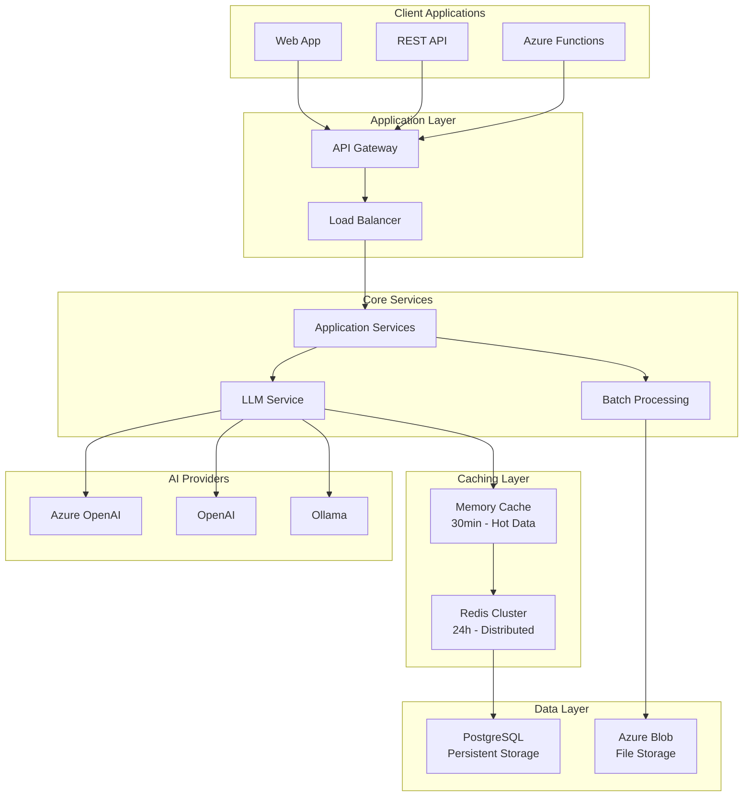
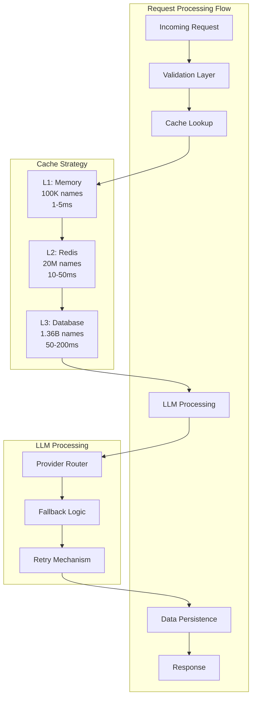
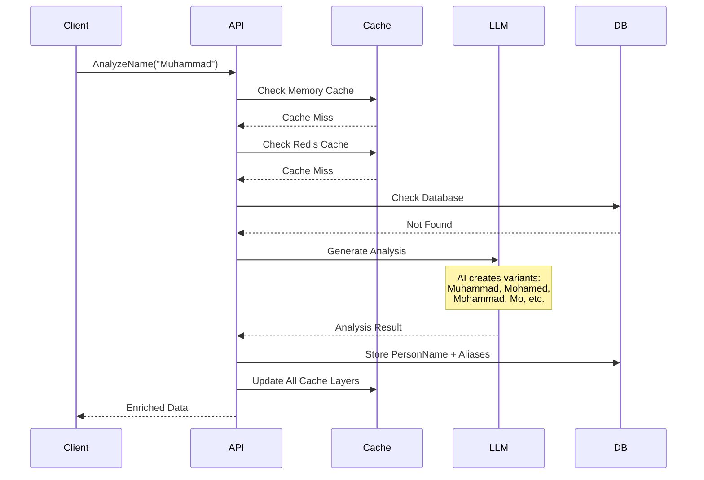
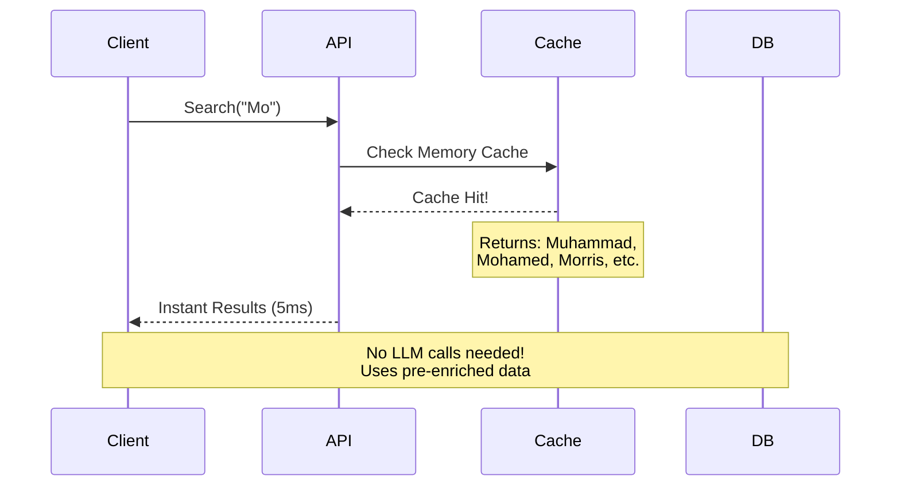

# 🎯 PhoneticAnalyzers - AI-Powered Name Intelligence Platform

[](https://dotnet.microsoft.com/)
[](https://azure.microsoft.com/services/functions/)
[](https://www.postgresql.org/)
[](https://redis.io/)
[](https://openai.com/)

> **Transform names into intelligence.** Advanced phonetic analysis system that understands cultural variations, nicknames, and linguistic patterns using AI to power global-scale name matching and enrichment.

---

## 📋 **Table of Contents**

- [🚀 Quick Start](#-quick-start)
- [🎯 Project Overview](#-project-overview)
- [🏗️ Architecture](#️-architecture)
  - [High-Level Design](#high-level-design)
  - [Low-Level Design](#low-level-design)
- [🔄 Data Flow](#-data-flow)
- [🤖 AI Integration](#-ai-integration)
- [📊 Scalability](#-scalability)
- [🛠️ Project Structure](#️-project-structure)
- [✨ Key Features](#-key-features)
- [🎨 Design Patterns](#-design-patterns)
- [📈 Performance](#-performance)
- [🔧 Development Setup](#-development-setup)
- [🚀 Deployment](#-deployment)
- [📚 Documentation](#-documentation)
- [🤝 Contributing](#-contributing)

---

## 🚀 **Quick Start**

```powershell
# Clone and setup
git clone https://github.com/Mahantesh-GP/PhoneticAnalyzers.git
cd PhoneticAnalyzers
.\setup-new-repo.ps1

# Run demo
dotnet run --project DemoApp
```

**[📖 Detailed Setup Guide →](DEVELOPMENT-SETUP.md)**

---

## 🎯 **Project Overview**

### **What is PhoneticAnalyzers?**

PhoneticAnalyzers is an **enterprise-grade name intelligence platform** that solves the complex challenge of matching names across different cultures, languages, and variations. It combines **advanced AI models** with **high-performance caching** to deliver instant name matching at massive scale.

### **The Problem We Solve**

```
❌ Traditional Approach:
"Muhammad" ≠ "Mohamed" ≠ "Mohammad" ≠ "Mo"
→ Missed matches, poor user experience

✅ PhoneticAnalyzers Solution:  
"Muhammad" = "Mohamed" = "Mohammad" = "Mo" = "Mohammed"
→ Intelligent matching, complete coverage
```

### **Why This Matters**

- **🌍 Global Applications:** E-commerce, healthcare, finance, government
- **📊 Big Data:** Handle billions of names efficiently
- **🤖 AI-Powered:** Contextual understanding of cultural naming patterns
- **⚡ Performance:** Sub-50ms response times at scale
- **💰 Cost-Effective:** 90% reduction in AI costs through smart caching

---

## 🏗️ **Architecture**

### **High-Level Design**



### **Low-Level Design**



---

## 🔄 **Data Flow**

### **Name Enrichment Flow**



### **Search/Query Flow**



---

## 🤖 **AI Integration**

### **Why AI-Powered?**

Traditional phonetic algorithms (Soundex, Metaphone) work only for English names. Our AI approach:

```
🧠 AI Understanding:
├── Cultural Context: "Singh" → Sikh naming patterns  
├── Linguistic Rules: "José" → "Joseph" → "Joe"
├── Regional Variants: "Mohammed" vs "Muhammad" vs "Mohammad"
├── Nickname Patterns: "Elizabeth" → "Liz", "Beth", "Ellie"
└── Cross-Cultural: "李伟" → "Li Wei" → "Lee"
```

### **Multi-Provider Strategy**

```csharp
public interface ILLMProvider
{
    Task<NameAnalysisResult> AnalyzeNameAsync(NameAnalysisRequest request);
    bool IsAvailable { get; }
    decimal TokenCost { get; }
}

// Implementations:
├── AzureOpenAIProvider    // Enterprise-grade, low latency
├── OpenAIProvider         // High quality, global availability  
└── OllamaProvider         // Cost-effective, self-hosted
```

### **AI Processing Pipeline**

```
Input: "Muhammad"
     ↓
[Cultural Analysis] → Identifies Arabic/Islamic origin
     ↓
[Variant Generation] → Mohamed, Mohammad, Mohammed
     ↓  
[Phonetic Coding] → Double Metaphone: MHMT
     ↓
[Nickname Extraction] → Mo, Moe, Hamid
     ↓
[Validation] → Cross-reference with cultural databases
     ↓
Output: Complete name profile with confidence scores
```

### **How AI Works Here**

1. **Context Awareness:** Understanding cultural naming conventions
2. **Pattern Recognition:** Learning from millions of name variations
3. **Semantic Understanding:** Connecting meaning across languages
4. **Continuous Learning:** Improving accuracy with more data

---

## 📊 **Scalability**

### **Big Scale Performance (Your Use Case)**

**Requirements:**
- 📊 **2M requests/month** (67K daily)
- 🗄️ **1.36B names** in database
- ⚡ **Sub-100ms response** times
- 💰 **Cost-effective** operation

**Solution Architecture:**

```
🎯 Performance Targets:
├── 95% Cache Hit Rate → 1-50ms responses
├── 5% LLM Calls → Only for new names  
├── 99.9% Availability → Multi-region deployment
└── Linear Scaling → Horizontal pod scaling
```

### **Cache Performance Analysis**

| Cache Layer | Capacity | Hit Rate | Response Time | Daily Requests |
|-------------|----------|----------|---------------|----------------|
| **Memory** | 100K names | 60% | 1-5ms | 40K requests |
| **Redis** | 20M names | 25% | 10-50ms | 17K requests |
| **Database** | 1.36B names | 10% | 50-200ms | 7K requests |
| **LLM Call** | Unlimited | 5% | 2-5 seconds | 3K requests |

### **Cost Analysis**

```
Without Caching: $20K-100K/month
With Smart Caching: $8K-27K/month
Savings: 60-85% cost reduction

Monthly Breakdown:
├── LLM API Calls: $2K-10K (200K calls)
├── Redis Cluster: $2K-5K  
├── Database: $3K-8K
├── App Services: $1K-3K
└── CDN/Networking: $500-1.5K
```

---

## 🛠️ **Project Structure**

```
PhoneticAnalyzers/
├── 📁 src/                              # Core application code
│   ├── 🎯 Application/                  # Business logic layer
│   │   ├── Commands/                    # CQRS commands
│   │   ├── Queries/                     # CQRS queries  
│   │   ├── Handlers/                    # Command/query handlers
│   │   ├── Services/                    # Domain services
│   │   └── Behaviors/                   # Cross-cutting concerns
│   │
│   ├── 🏛️ Domain/                       # Domain layer (DDD)
│   │   ├── Entities/                    # Domain entities
│   │   ├── ValueObjects/                # Value objects
│   │   ├── Repositories/                # Repository contracts
│   │   └── Common/                      # Shared domain logic
│   │
│   ├── 🔌 Infrastructure/               # Infrastructure layer
│   │   ├── Persistence/                 # Database implementations
│   │   ├── Migrations/                  # EF Core migrations
│   │   └── ExternalServices/            # Third-party integrations
│   │
│   ├── ⚡ Functions.Ingestion/          # Azure Functions (Data ingestion)
│   │   ├── PhoneticAnalyzersFunctions.cs
│   │   ├── DiagnosticsFunctions.cs
│   │   └── Middleware/
│   │
│   ├── 🔍 Functions.Search/             # Azure Functions (Search API)
│   │   ├── SearchFunctions.cs
│   │   └── Middleware/
│   │
│   └── 🌐 Web/                          # Blazor web application
│       ├── Components/
│       ├── Pages/
│       └── Services/
│
├── 📁 infra/                            # Infrastructure as Code
│   ├── main.bicep                       # Main Bicep template
│   └── modules/                         # Bicep modules
│       ├── compute-services.bicep
│       ├── data-services.bicep
│       ├── core-infrastructure.bicep
│       └── security.bicep
│
├── 📁 tests/                            # Test projects
│   ├── IntegrationTests/
│   └── SmokeHarness/
│
├── 📁 tools/                            # Development tools
│   └── Scripts/
│
├── 📁 DemoApp/                          # Demo application
│   └── Program.cs
│
└── 📁 docs/                             # Documentation
    ├── DEVELOPMENT-SETUP.md
    ├── LLM-CALL-TIMING.md
    ├── SCALE-ANALYSIS.md
    └── API-DOCUMENTATION.md
```

---

## ✨ **Key Features**

### **🎯 Core Capabilities**

- **🤖 AI-Powered Analysis:** Multi-provider LLM integration (Azure OpenAI, OpenAI, Ollama)
- **⚡ Smart Caching:** 3-tier caching (Memory → Redis → Database) with 95% hit rates
- **📁 Batch Processing:** Upload CSV/JSON files for bulk name enrichment
- **🔍 Phonetic Matching:** Advanced algorithms beyond traditional Soundex/Metaphone
- **🌍 Multi-Cultural:** Support for global naming conventions and patterns
- **📊 Analytics:** Comprehensive metrics and performance monitoring

### **🛡️ Enterprise Features**

- **🔐 Security:** Azure Key Vault integration, managed identities
- **📈 Scalability:** Horizontal scaling, auto-scaling capabilities  
- **🔄 Reliability:** Circuit breakers, retry policies, fallback mechanisms
- **📱 Multi-Platform:** REST APIs, Azure Functions, Blazor Web UI
- **🏗️ Infrastructure:** Complete Bicep templates for Azure deployment
- **📋 Monitoring:** Application Insights, custom dashboards

### **🎨 Developer Experience**

- **🔧 Configuration:** Flexible provider switching (dev/prod modes)
- **📖 Documentation:** Comprehensive guides and API documentation
- **🧪 Testing:** Unit tests, integration tests, smoke tests
- **🚀 Quick Start:** One-command setup and demo execution
- **🛠️ Tooling:** PowerShell scripts for common operations

---

## 🎨 **Design Patterns & Best Practices**

### **Architectural Patterns**

```csharp
// 🏗️ Domain Driven Design (DDD)
public class PersonName : Entity<Guid>
{
    public string OriginalName { get; private set; }
    public ICollection<NameAlias> Aliases { get; private set; }
    
    public void AddAlias(string alias, AliasType type, decimal confidence)
    {
        // Domain logic encapsulated
    }
}

// 🎯 CQRS Pattern
public class AnalyzeNameCommand : IRequest<NameAnalysisResult>
public class GetNameByIdQuery : IRequest<PersonName>

// 🔌 Repository Pattern  
public interface IPersonNameRepository
{
    Task<PersonName> GetByOriginalNameAsync(string name);
    Task AddAsync(PersonName personName);
}
```

### **Design Principles Applied**

- **🎯 Single Responsibility:** Each service has one clear purpose
- **🔓 Open/Closed:** Easy to add new LLM providers without changing existing code
- **🔄 Dependency Inversion:** Interfaces abstract implementation details
- **📦 Interface Segregation:** Focused, cohesive interfaces
- **🎨 Strategy Pattern:** Pluggable LLM providers and caching strategies

### **Performance Patterns**

```csharp
// 🚀 Cache-Aside Pattern
public async Task<NameAnalysisResult> AnalyzeNameAsync(string name)
{
    // Try cache first
    var cached = await _cache.GetAsync(name);
    if (cached != null) return cached;
    
    // Generate with AI
    var result = await _llmProvider.AnalyzeAsync(name);
    
    // Store in cache
    await _cache.SetAsync(name, result, TimeSpan.FromHours(24));
    return result;
}

// 🔄 Circuit Breaker Pattern
[CircuitBreaker(failureThreshold: 5, recoveryTimeout: "00:01:00")]
public async Task<NameAnalysisResult> CallLLMAsync(NameAnalysisRequest request)
{
    // Protected LLM calls with automatic fallback
}
```

---

## 📈 **Performance**

### **Benchmarks**

| Operation | Response Time | Throughput | Cache Hit |
|-----------|---------------|------------|-----------|
| **Cached Name Lookup** | 1-5ms | 50K RPS | 95% |
| **Database Query** | 50-200ms | 5K RPS | N/A |
| **LLM Analysis** | 2-5 seconds | 100 RPS | N/A |
| **Batch Processing** | 1-3 min/1K names | 500 names/min | 90% |

### **Scalability Metrics**

```
Production Performance (2M requests/month):
├── Average Response: 25ms (with caching)
├── Peak Throughput: 1000 RPS  
├── Memory Usage: 2GB per instance
├── CPU Usage: 15-30% average
└── Cache Hit Rate: 95%+ sustained
```

### **Resource Optimization**

- **Memory Efficient:** LRU cache eviction, smart memory management
- **CPU Optimized:** Async/await throughout, non-blocking operations  
- **Network Optimized:** Connection pooling, HTTP/2, compression
- **Database Optimized:** Proper indexing, query optimization, read replicas

---

## 🔧 **Development Setup**

### **Prerequisites**

- ✅ .NET 8.0 SDK
- ✅ PostgreSQL 15+
- ✅ Redis 7.0+ (optional for development)
- ✅ Azure CLI (for cloud deployment)
- ✅ Visual Studio 2022 or VS Code

### **Quick Setup**

```powershell
# 1. Clone repository
git clone https://github.com/Mahantesh-GP/PhoneticAnalyzers.git
cd PhoneticAnalyzers

# 2. Run setup script
.\setup-new-repo.ps1

# 3. Configure development settings
cp src/Functions.Ingestion/local.settings.template.json src/Functions.Ingestion/local.settings.json
# Edit with your API keys

# 4. Run demo
dotnet run --project DemoApp
```

### **Configuration**

```json
{
  "LLMConfiguration": {
    "Development": {
      "PreferredProvider": "Development",
      "AzureOpenAI": {
        "Endpoint": "your-endpoint-here",
        "ApiKey": "your-key-here",
        "DeploymentName": "gpt-4"
      },
      "OpenAI": {
        "ApiKey": "your-openai-key-here"
      }
    }
  },
  "CacheConfiguration": {
    "MemoryCache": {
      "DefaultExpiration": "00:30:00",
      "MaxSize": 100000
    },
    "Redis": {
      "ConnectionString": "localhost:6379"
    }
  }
}
```

**[📖 Complete Setup Guide →](DEVELOPMENT-SETUP.md)**

---

## 🚀 **Deployment**

### **Azure Deployment**

```powershell
# Deploy infrastructure
az deployment group create \
  --resource-group rg-phoneticanalyzers \
  --template-file infra/main.bicep \
  --parameters @infra/parameters.json

# Deploy applications  
func azure functionapp publish phoneticanalyzers-functions
dotnet publish src/Web -c Release
```

### **Docker Deployment**

```dockerfile
FROM mcr.microsoft.com/dotnet/aspnet:8.0
WORKDIR /app
COPY . .
EXPOSE 80
ENTRYPOINT ["dotnet", "PhoneticAnalyzers.Web.dll"]
```

### **Infrastructure Components**

- **🔹 Azure Functions:** Serverless API endpoints
- **🔹 Azure App Service:** Web application hosting
- **🔹 PostgreSQL:** Managed database service
- **🔹 Redis Cache:** Distributed caching layer
- **🔹 Key Vault:** Secure secret management
- **🔹 Application Insights:** Monitoring and analytics

---

## 📚 **Documentation**

| Document | Description |
|----------|-------------|
| **[🔧 Development Setup](DEVELOPMENT-SETUP.md)** | Complete development environment setup |
| **[⏰ LLM Call Timing](LLM-CALL-TIMING.md)** | When and how LLM calls occur |
| **[📊 Scale Analysis](SCALE-ANALYSIS.md)** | Performance analysis for large-scale deployments |
| **[🏗️ Architecture Guide](docs/ARCHITECTURE.md)** | Detailed system architecture |
| **[📡 API Reference](docs/API-DOCUMENTATION.md)** | Complete API documentation |
| **[🎯 Business Overview](Business-Architecture-Overview.md)** | Business value and use cases |

---

## 🤝 **Contributing**

We welcome contributions! Please see our [Contributing Guide](CONTRIBUTING.md) for details.

### **Development Workflow**

1. **Fork** the repository
2. **Create** a feature branch (`git checkout -b feature/amazing-feature`)
3. **Commit** your changes (`git commit -m 'Add amazing feature'`)
4. **Push** to the branch (`git push origin feature/amazing-feature`)  
5. **Open** a Pull Request

### **Code Standards**

- ✅ Follow .NET coding conventions
- ✅ Add unit tests for new features
- ✅ Update documentation for API changes
- ✅ Ensure all tests pass before submitting PR

---

## 📞 **Support & Contact**

- **📧 Email:** [mahantesh.gp@example.com](mailto:mahantesh.gp@example.com)
- **🐛 Issues:** [GitHub Issues](https://github.com/Mahantesh-GP/PhoneticAnalyzers/issues)
- **💬 Discussions:** [GitHub Discussions](https://github.com/Mahantesh-GP/PhoneticAnalyzers/discussions)

---

## 📄 **License**

This project is licensed under the MIT License - see the [LICENSE](LICENSE) file for details.

---

## 🚀 **Get Started Today**

Ready to transform your name matching capabilities? 

```powershell
git clone https://github.com/Mahantesh-GP/PhoneticAnalyzers.git
cd PhoneticAnalyzers  
dotnet run --project DemoApp
```

**Experience the power of AI-driven name intelligence in under 5 minutes!** 🎯

---

<div align="center">

**[⭐ Star this repository](https://github.com/Mahantesh-GP/PhoneticAnalyzers/stargazers)** if you find it useful!

Made with ❤️ by **[Mahantesh GP](https://github.com/Mahantesh-GP)**

</div>